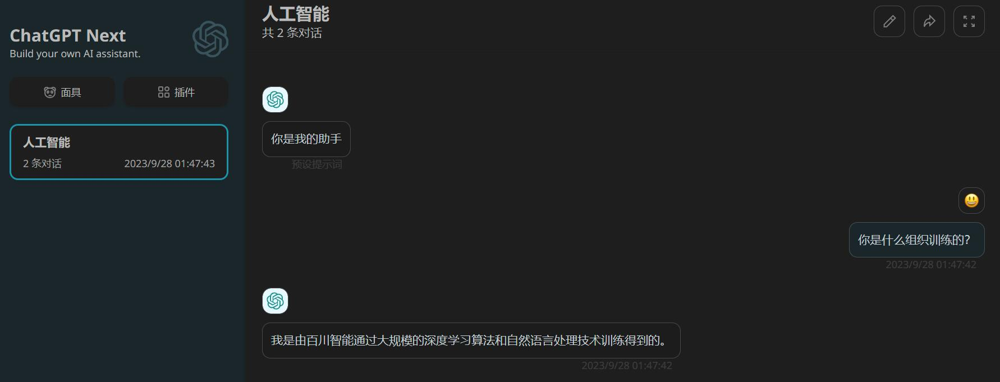

# openai-adapter

[](https://opensource.org/licenses/Apache-2.0)

Deploy local API based on OpenAI API.

## Features

- OpenAI API Adapter
- Chat Bot

## Architecture


## Usage

First, clone this repo and the open source LLM repos.

```shell
git clone https://github.com/tutils/openai-adapter.git
```

| Supported   | Used in examples           |
| :---------- | :------------------------- |
| [Baichuan2] | [Baichuan2-13B-Chat-4bits] |
| [ChatGLM2]  | [chatglm2-6b-int4]         |
| [Qwen]      | [Qwen-14B-Chat-Int4]       |

[Baichuan2]: https://github.com/baichuan-inc/baichuan2
[ChatGLM2]: https://github.com/THUDM/ChatGLM-6B
[Qwen]: https://github.com/QwenLM/Qwen
[Baichuan2-13B-Chat-4bits]: https://huggingface.co/baichuan-inc/Baichuan2-13B-Chat-4bits
[chatglm2-6b-int4]: https://huggingface.co/THUDM/chatglm2-6b-int4
[Qwen-14B-Chat-Int4]: https://huggingface.co/Qwen/Qwen-14B-Chat-Int4

Make sure the dependencies of the LLMs are installed correctly, and the directory tree should like this:

```shell
tree
.
├── Baichuan2
│   └── baichuan-inc
│       └── Baichuan2-13B-Chat-4bits
├── ChatGLM2-6B
│   └── THUDM
│       └── chatglm2-6b
├── Qwen
│   └── Qwen
│       └── Qwen-14B-Chat-Int4
└── openai-adapter
    ├── adapter
    └── examples
```

Then, start the api server.

```shell
cd openai-adapter
pip install -i requirements.txt
# USE_SERVICE can be: baichuan2, chatglm2, qwen
PYTHONPATH=$PWD USE_SERVICE=baichuan2 python examples/api_server.py
```

Finally, launch your ChatGPT application (e.g. [ChatGPT Next](https://github.com/Yidadaa/ChatGPT-Next-Web))

```shell
docker run --rm -p 3000:3000 -e BASE_URL='http://localhost:8000' yidadaa/chatgpt-next-web
```

You can test the application mentioned above by visiting http://localhost:3000/.



Of course, you can also directly use the SDK provided by OpenAI.

```python
import openai
openai.api_base = "http://localhost:8000/v1"
openai.api_key = "none"

# create a request activating streaming response
for chunk in openai.ChatCompletion.create(
    model="gpt-3.5-turbo",
    messages=[
        {"role": "user", "content": "你好"}
    ],
    stream=True
    # Specifying stop words in streaming output format is not yet supported and is under development.
):
    if hasattr(chunk.choices[0].delta, "content"):
        print(chunk.choices[0].delta.content, end="", flush=True)

# create a request not activating streaming response
response = openai.ChatCompletion.create(
    model="gpt-3.5-turbo",
    messages=[
        {"role": "user", "content": "你好"}
    ],
    stream=False,
    stop=[] # You can add custom stop words here, e.g., stop=["Observation:"] for ReAct prompting.
)
print(response.choices[0].message.content)
```

For other usage details, see [examples](https://github.com/tutils/openai-adapter/tree/main/examples).
